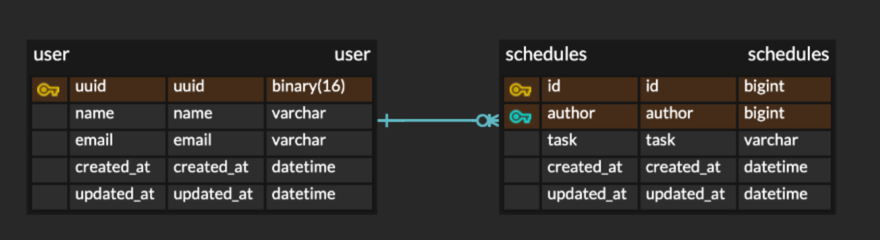

# 일정 관리 앱
- 레벨별로 브랜치를 분리했습니다.
## API 명세
| 기능       | Method | URL             | request                                 | response  | 상태 코드 |
|----------|--------|-----------------|-----------------------------------------|-----------|-------|
| 전체 일정 조회 | GET    | /schedules      | 요청 param (updatedDate?, authorUuid?)    | 일정 정보 리스트 | 200   |
| 단일 일정 조회 | GET    | /schedules/{id} | -                                       | 해당 일정 정보  | 200   |
| 일정 생성    | POST   | /schedules      | 요청 body (task!, authorUuid!, password!) | 생성 일정 정보  | 201   |
| 일정 수정    | PATCH  | /schedules/{id} | 요청 body (task?, authorUuid?, password!) | 수정 일정 정보  | 200   |
| 일정 삭제    | DELETE | /schedules/{id} | 요청 body (password!)                     | -         | 200   |

## ERD
